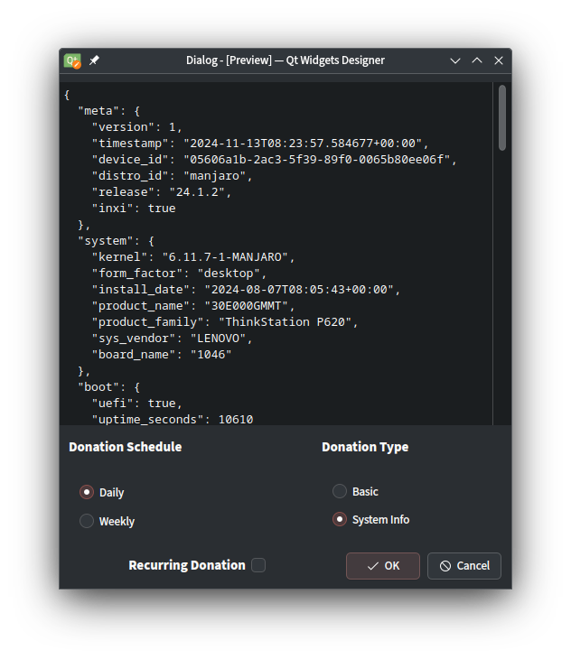
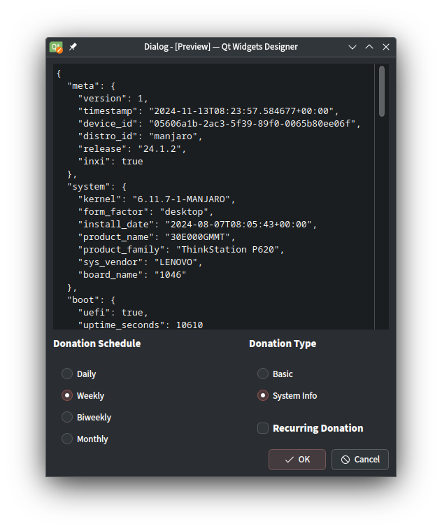

# Manjaro Data Donor

MDD provides us with a secure way to receive anonymized data about the usage of Manjaro.
This way we can learn how Manjaro is used by our users and we can focus our efforts on what matters most in order to improve the user experience.

**The data is anonym in two ways:**
- We only collect impersonal information about the hardware and the environment. In particular **we don't store IP addresses**.
- To differentiate systems we need a unique identifer. For that we use [`/etc/machine-id`](https://www.freedesktop.org/software/systemd/man/latest/machine-id.html), what is hashed before being sent.

The data is being stored in a database on one of our Hetzner servers. Visualizations of the data are made available via Grafana [here](https://metrics.manjaro.org/public-dashboards/cb0f690cba304389bf3ed2c254c14c01). We plan on adding more charts for interesting data later on.

## Setup Instructions

1. **Install package dependencies**:
   ```bash
   sudo pacman -S git python-pip inxi
   ```
2. **Clone this repo** to your computer and navigate to the project directory:
   ```bash
   git clone https://github.com/manjaro/mdd
   cd mdd
   ```
3. **Create a virtual environment** (recommended) to manage dependencies:
   ```bash
   python -m venv venv
   source venv/bin/activate
   ```
4. **Install the dependencies** listed in `requirements.txt`:
   ```bash
   pip install -r requirements.txt
   ```
5. **Run the script**:
   ```bash
   python mdd.py
   ```
6. **Deactivate the virtual environment** when done:
   ```bash
   deactivate
   ```

## Usage
### Dry Run
Run the script without any arguments to send data directly. The submitted data will be displayed on the terminal.
Additionally you can first run

```bash
python mdd.py --dry-run
```

in order to only display the data that would be sent without actually doing so.

### Telemetry
If you only want to count the device but not provide any data about your system, then run:

```bash
python mdd.py --disable-telemetry
```

If possible please provide all information though. It helps us with learning about what our users need. And the graphs look cool!

### Debugging
The log level can be increased from `WARNING` to `INFO`/`DEBUG` with:

```bash
python mdd.py --log INFO
```

By default MDD tries to use [inxi](https://smxi.org/docs/inxi.htm) for gathering information about the system. For debugging this can be deactivated:

```bash
MDD_DISABLE_INXI=1 python mdd.py
```

## GUI
Higher frequency and more data makes the most reliable picture.

Protyped GUI to display a preview of the data collection.

The option reflects

- a basic collection - equals to using the --disable-telemetry flag
- a sysinfo collection - the default

If you were to make a financial donation you would have options to do so as a onetime, monthly or yearly donation so I created something simliar to that *daily*, *weekly*, *bi-weekly*, *monthly*. Finally a check box for a regular donation your system info.

The idea is that the script will create a set of systemd user unit files when you click the options.

- a service which reflects the type of donation
- a time which reflects the schedule of donating the info

When you tick the Regular Donation check box the generated user timer will be enabled with the selected schedule.

When user click OK - user is making a one time donation. 

With a first time donation, we request the sysinfo as this is the only way to understand the hardware landscape in userland.

What has been selected is saved to the user's .config folder and is preloaded when opening the GUI next time.

The prototyped layout looks like this.

### 2 option schedule


### 4 option schedule

